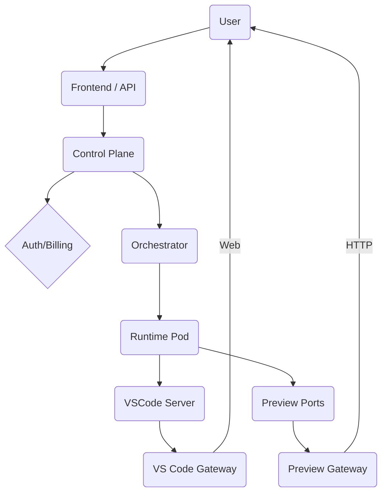

# OpenHands Cloud-Native SaaS Design

## Introduction
This document analyzes the OpenHands repository and documentation to design a scalable, multi-tenant, white-label SaaS version. The focus areas include networking, VS Code integration, stack detection, dependency management, secure isolation, authentication, billing hooks, and deployment on Google Cloud.

## Current Architecture Overview
OpenHands runs agents inside isolated runtimes (usually Docker). The backend exposes REST endpoints such as `/api/conversations/{id}/vscode-url` and `/web-hosts` for previews. VS Code tokens are retrieved via `get_vscode_token()` in `ActionExecutionClient` and each runtime computes a `vscode_url`. Local runtime defaults to `localhost` while remote runtimes build URLs based on runtime IDs.

The `docs` directory provides high‑level diagrams of runtime and backend architectures. The default runtime uses Docker with image tagging for efficient rebuilds.

## Problems for Cloud Deployment
1. **Localhost URLs** – preview hosts and VS Code URLs embed `localhost`, preventing public access.
2. **Single-User Auth** – `DefaultUserAuth` always returns `None` for user ID. There is no tenant isolation or billing support.
3. **Static Port Mapping** – ports are randomly chosen but not exposed via subdomain routing. Cloud systems require deterministic routing rules.
4. **Dependency Installation** – Agents rely on prompts to install packages based on repo files. There is no automatic build pipeline.
5. **Analytics & Branding** – The front end includes PostHog and branded logos which must be optional for white-label deployments.

## Proposed Multi‑Tenant SaaS Architecture
### Control Plane
* **Auth Service** – Replace `DefaultUserAuth` with OAuth/OIDC based auth (e.g., Google, GitHub). Store user profiles, tenant IDs and billing state in CloudSQL (Postgres).
* **Billing Service** – Hook into usage events and integrate with Stripe. `ENABLE_BILLING` flag in `ServerConfig` already exists.
* **Orchestrator** – A component controlling runtime pods on GKE. Each conversation gets a pod in a namespace linked to the tenant.

### Data Plane
* **Runtime Pods** – Container images built from user repos using Buildpacks/Nixpacks. Each pod exposes the action server, VS Code server and preview ports behind an Ingress. Pods run with limited CPU/memory and are automatically cleaned up.
* **Preview Gateway** – NGINX/Traefik ingress that routes `https://{runtime-id}.{domain}` to the correct pod service. `/vscode` and app ports are mapped similarly.
* **VS Code Gateway** – WebSocket reverse proxy handling authentication and forwarding to the pod’s code-server.

### Flow Diagram


## Automatic Stack Detection and Build
1. **Detect** – Inspect repo for `package.json`, `requirements.txt`, `pom.xml`, `Dockerfile`, etc.
2. **Build** – Use Cloud Native Buildpacks or Nixpacks to create a container image. Fallback to `docker compose up` if a compose file exists.
3. **Serve** – For static sites, run the generated build with `nginx`; for frameworks (Node, Flask, etc.) run the provided start script.
4. **Cache** – Reuse images based on commit hash to speed up subsequent runs.

## Fixing VS Code URLs
Modify runtime `vscode_url` properties to build URLs using the request origin or an environment variable such as `PUBLIC_HOSTNAME`. Example patch for `docker_runtime.py`:
```diff
- vscode_url = f'http://localhost:{self._vscode_port}/?tkn={token}&folder={self.config.workspace_mount_path_in_sandbox}'
+ host = os.getenv("PUBLIC_HOSTNAME", f"vscode-{self.container_name}.{BASE_DOMAIN}")
+ vscode_url = f'https://{host}/?tkn={token}&folder={self.config.workspace_mount_path_in_sandbox}'
```
Similar changes apply to `local_runtime.py` and other runtimes.

## Security and Isolation
* Use separate Kubernetes namespaces per tenant. Apply PodSecurityPolicies or GKE Autopilot to restrict capabilities.
* Each runtime pod runs with a unique service account to isolate access to Cloud resources.
* NetworkPolicies block inter-tenant traffic. Only the proxy/gateway can reach pods.
* Store secrets in Secret Manager and mount them at runtime.

## White‑Label Considerations
* Remove PostHog analytics (`frontend/src/entry.client.tsx`) when `POSTHOG_CLIENT_KEY` is empty.
* Provide hooks to swap logos and CSS. Keep MIT license notice in the About page but allow custom branding elsewhere.

## Deployment on Google Cloud
1. **Container Registry** – Store runtime and application images in Artifact Registry.
2. **GKE or Cloud Run** – Use GKE Autopilot for fine‑grained control or Cloud Run for simpler scaling. Cloud Run revisions can map to runtime IDs with the domain pattern `https://{runtime-id}-{hash}.a.run.app`.
3. **CloudSQL** – Host metadata (users, conversations, billing info).
4. **Pub/Sub** – Optional event bus for monitoring and billing events.

### Steps
1. Build base runtime images and push to Artifact Registry.
2. Deploy the control plane API (FastAPI) on Cloud Run or GKE.
3. Deploy the preview and VS Code gateways as Ingress controllers (Traefik or NGINX).
4. On conversation start, orchestrator launches a pod and returns URLs for VS Code and previews.
5. Users connect via browser; traffic is routed through the gateways with JWT authentication.

## Risks and Mitigations
| Risk | Mitigation |
| --- | --- |
| Resource exhaustion from many pods | Set CPU/memory limits and auto‑scale nodes. Implement quotas per tenant. |
| Unauthorized access between tenants | Use namespaces, NetworkPolicies and per‑tenant service accounts. JWT authentication on gateways. |
| Cost overruns | Integrate billing hooks into conversation lifecycle. Use Cloud Monitoring to track usage. |
| Build failures for uncommon stacks | Allow user-supplied Dockerfiles. Provide fallback images with common tools installed. |

## Open Questions
1. How to handle long‑running builds that exceed Cloud Run timeouts? GKE pods may be required.
2. What level of isolation is required for browser automation (e.g., separate headless Chrome pods)?
3. Should runtimes persist across sessions or be ephemeral per task?

## Next Experiments
* Prototype stack detection using Nixpacks and measure build times on sample repos.
* Test a Traefik ingress setup with subdomain routing for VS Code and preview ports.
* Implement OAuth-based `UserAuth` and verify multi-tenant secrets store with CloudSQL.
```
